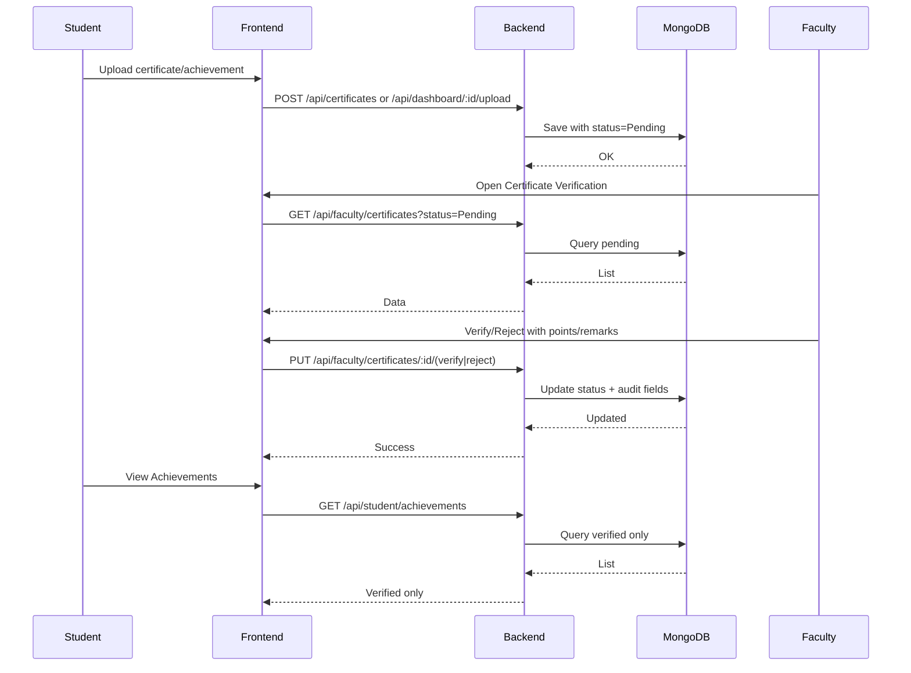
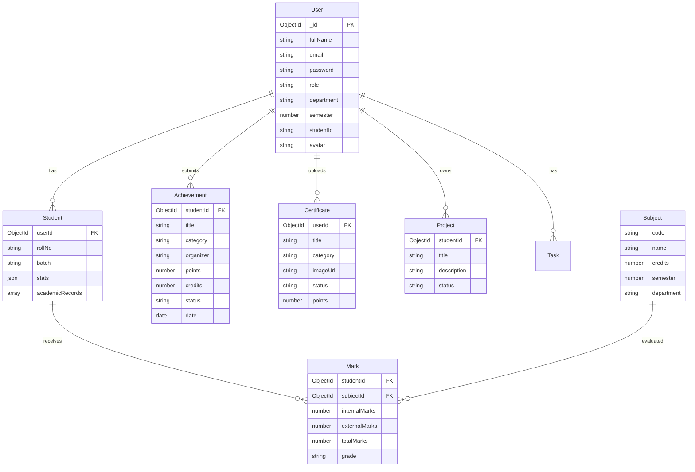
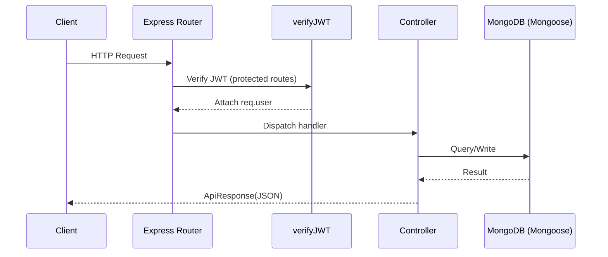
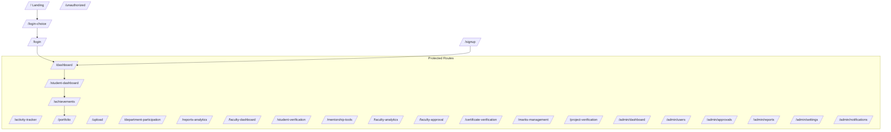
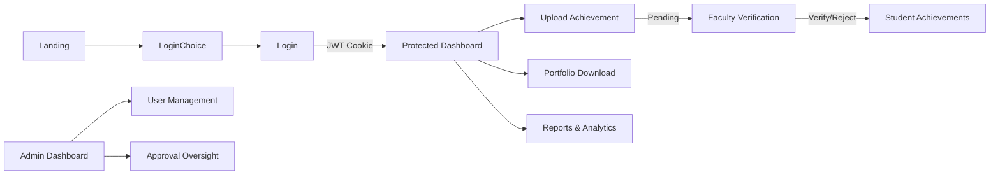

# Smart Student Hub — Developer Onboarding (Single File)

This is the one file every developer should read first. It consolidates architecture, flows, data models, project structure, setup, and key conventions with visual diagrams.

- Repo root: `d:/all my files/study material/codes/Windsurf/`
- Frontend: `src/`
- Backend: `backend/src/`
- Start here: `src/App.jsx`, `backend/src/index.js`

---

## 1) High-Level Architecture

```mermaid
flowchart LR
  subgraph Client[Frontend (React + Vite + TailwindCSS)]
    UI[Pages & Components]
    Router[React Router / ProtectedRoute]
    AuthCTX[AuthContext]
    Services[API Service Layer]
  end

  subgraph Server[Backend (Node.js + Express)]
    Routes[Express Routes]
    Ctrls[Controllers]
    Middleware[Auth & Error Middleware]
    Utils[Utils (ApiError/Response)]
  end

  subgraph DB[MongoDB]
    Users[(users)]
    Students[(students)]
    Achievements[(achievements)]
    Certificates[(certificates)]
    Projects[(projects)]
    Marks[(marks)]
    Subjects[(subjects)]
    Tasks[(tasks)]
  end

  UI --> Router --> Services --> Server
  Server --> Routes --> Ctrls --> DB
  Ctrls --> Middleware
  AuthCTX <--> Services
```

---

## 2) Authentication & Authorization Flow

- JWT auth with httpOnly cookies
- Role-based access: `student`, `faculty`, `admin`
- Protected routes via `src/components/ProtectedRoute.jsx`

```mermaid
sequenceDiagram
  participant U as User (Browser)
  participant FE as Frontend (React)
  participant BE as Backend (Express)
  participant DB as MongoDB

  U->>FE: Login credentials
  FE->>BE: POST /api/auth/login
  BE->>DB: Validate user
  DB-->>BE: User found
  BE-->>U: Set httpOnly JWT cookie + user payload
  U->>FE: Navigates to protected route
  FE->>FE: ProtectedRoute checks role
  FE->>BE: GET /api/auth/me (optional)
  BE-->>FE: Current user
  FE-->>U: Render route if allowed; else redirect /unauthorized
```

Key files:
- `backend/src/middlewares/auth.middleware.js` — `verifyJWT`
- `src/components/ProtectedRoute.jsx` — client-side guard
- `src/context/AuthContext.jsx` — auth state

---

## 3) Certificate Verification Workflow (Faculty)



Key files:
- Backend: `backend/src/routes/faculty.route.js`, `backend/src/controllers/certificate.controller.js`
- Frontend: `src/pages/CertificateVerification.jsx`, `src/pages/StudentAchievements.jsx`

---

## 4) Entity-Relationship Diagram (ERD)



Model files are under `backend/src/models/`:
- `user.model.js`, `student.model.js`, `achievement.model.js`, `certificate.model.js`, `project.model.js`, `subject.model.js`, `mark.model.js`, `task.model.js`

---

## 5) Backend Request Lifecycle



Conventions:
- All responses use `ApiResponse`
- Errors bubble via `ApiError` and async handler
- Auth guard: `verifyJWT` before protected routes

Examples:
- Route: `backend/src/routes/studentDashboard.route.js`
- Controller: `backend/src/controllers/studentDashboard.controller.js`

---

## 6) Frontend Routing Map

Main routes are defined in `src/App.jsx`.



Role gates are enforced via `ProtectedRoute` with `allowedRoles` prop.

---

## 7) Project Structure (Essentials)

```
Windsurf/
├─ src/
│  ├─ components/
│  │  ├─ ProtectedRoute.jsx
│  │  ├─ Layout.jsx, Sidebar.jsx, Header.jsx
│  │  ├─ Button.jsx, Card.jsx, StatsCard.jsx, Toast.jsx
│  │  └─ ErrorBoundary.jsx
│  ├─ context/
│  │  └─ AuthContext.jsx
│  ├─ pages/ (30+)
│  │  ├─ StudentDashboard.jsx, StudentAchievements.jsx, AcademicProgress.jsx
│  │  ├─ CertificateVerification.jsx, FacultyDashboard.jsx, FacultyAnalytics.jsx
│  │  ├─ AdminDashboard.jsx, UserManagement.jsx, ApprovalOversight.jsx
│  │  └─ Reports.jsx, DepartmentParticipation.jsx, UploadAchievement.jsx
│  ├─ App.jsx, main.jsx, index.css
│  └─ utils/, services/, hooks/
├─ backend/
│  ├─ src/
│  │  ├─ index.js, app.js
│  │  ├─ routes/ (user.route.js, faculty.route.js, studentDashboard.route.js, ...)
│  │  ├─ controllers/ (user.controller.js, certificate.controller.js, ...)
│  │  ├─ models/ (user.model.js, student.model.js, ...)
│  │  ├─ middlewares/ (auth.middleware.js, error.middleware.js)
│  │  └─ utils/ (ApiError.js, ApiResponse.js, asyncHandlers.js)
│  └─ public/
└─ README.md, COMPREHENSIVE_PROJECT_DOCUMENTATION.md, API_DOCUMENTATION.md, DEPLOYMENT_GUIDE.md
```

---

## 8) Local Setup (Quick Start)

- Frontend
  - `npm install`
  - `npm run dev`
  - URL: `http://localhost:5173`

- Backend
  - `cd backend && npm install`
  - Ensure `.env` configured (see `DEPLOYMENT_GUIDE.md`)
  - `npm run dev`
  - URL: `http://localhost:8000`

- Critical env vars (backend)
  - `PORT=8000`
  - `MONGODB_URI=mongodb://localhost:27017/smart-student-hub`
  - `JWT_SECRET`, `JWT_REFRESH_SECRET`
  - `CORS_ORIGIN=http://localhost:5173`

---

## 9) Coding Conventions & Patterns

- **Responses**: Use `ApiResponse` for consistent API output
- **Errors**: Throw `ApiError` with proper HTTP codes
- **Async**: Wrap routes with `asyncHandler`
- **Auth**: Guard protected APIs with `verifyJWT`
- **UI**: Use `Button`, `Card`, `StatsCard`, `Toast` for consistency
- **State**: Keep auth state in `AuthContext`; page-level state local
- **Security**: Never expose JWT in JS; always httpOnly cookies

---

## 10) Common Developer Tasks

- Add a new protected page
  - Create page in `src/pages/`
  - Add route in `src/App.jsx` inside `ProtectedRoute`
  - Pass `allowedRoles={[...]}` as needed

- Add a new API
  - Define route in `backend/src/routes/`
  - Implement controller in `backend/src/controllers/`
  - Add model or extend schema as needed
  - Return `ApiResponse`

- Add a new model
  - Create schema in `backend/src/models/`
  - Add indices for query perf
  - Reference via ObjectId where needed

---

## 11) Key References (Must Read Files)

- Frontend
  - `src/App.jsx` — route map and role gates
  - `src/components/ProtectedRoute.jsx` — access control
  - `src/context/AuthContext.jsx` — auth persistence
  - `src/pages/StudentDashboard.jsx` — student data consumption example
  - `src/pages/CertificateVerification.jsx` — faculty verification UI

- Backend
  - `backend/src/index.js`, `backend/src/app.js` — server bootstrap & middleware
  - `backend/src/middlewares/auth.middleware.js` — JWT verification
  - `backend/src/controllers/studentDashboard.controller.js` — dashboard aggregator
  - `backend/src/controllers/certificate.controller.js` — certificate workflow
  - `backend/src/routes/faculty.route.js` — faculty endpoints

---

## 12) Deployment (At a Glance)

- Local
  - FE: `npm run dev`
  - BE: `npm run dev` (backend)
- Production
  - Build FE: `npm run build`
  - Serve FE via Nginx (static) + proxy `/api` to backend
  - Run BE with PM2 or Docker
- See: `DEPLOYMENT_GUIDE.md`

---

## 13) Troubleshooting Cheatsheet

- CORS error
  - Ensure `CORS_ORIGIN` matches frontend URL
- 401 Unauthorized
  - Cookie not set? Check secure flags in dev vs prod
- Infinite redirect/unauthorized
  - Check `allowedRoles` in `ProtectedRoute` and login role
- Missing data on dashboard
  - See `getStudentDashboard()` in `backend/src/controllers/studentDashboard.controller.js`

---

## 14) Visual: End-to-End User Journey



---

## 15) Where to go next

- For detailed, narrative docs: `COMPREHENSIVE_PROJECT_DOCUMENTATION.md`
- For endpoint specifics: `API_DOCUMENTATION.md`
- For deployment: `DEPLOYMENT_GUIDE.md`

This single file plus the three detailed docs should give any developer a fast, accurate ramp-up path.
